---
title:
abstract: |
    Modern electromagnetic (EM) surveys deliver high-quality data with broad
    spatial coverage and high spatial density, providing an opportunity to
    produce higher-quality images of the Earth's subsurface than in the
    past. Because geological structures are inherently three-dimensional,
    the ultimate goal of an EM survey is to recover a 3D conductivity model
    that supports robust decision-making and interpretation. Nonetheless,
    practical inversion and interpretation workflows often still rely on
    simplifying assumptions, such as a one-dimensional layered earth or
    parametric targets like plates. This paper illustrates the value of
    incorporating 3D forward simulation into the interpretation workflow. By
    running a forward simulation for the EM responses of inversion-derived
    models in full 3D, practitioners can assess the consistency of inversion
    results with the measured data and identify potential artifacts. Using
    two examples: a dipping conductor and a porphyry-style deposit, we
    demonstrate how models that appear plausible under 1D assumptions fail
    under 3D scrutiny. Identifying areas where 1D assumptions fail can
    prompt additional analysis, such as iterative hypothesis testing or more
    focussed 3D inversions. As such, 3D forward simulation should be
    considered an essential tool in the EM practitioner's toolbox.

---

# Introduction

Variations in subsurface electrical conductivity are diagnostic for a
wide range of geoscience and engineering problems that include mineral
exploration, groundwater mapping, CO$_{2}$ sequestration, geothermal
development, and environmental remediation. Because geological
structures are inherently 3D, the ultimate goal of an electromagnetic
(EM) survey is to recover a 3D conductivity model that can guide
decisions and interpretations.

Modern surveys now have the spatial coverage and data density needed to
support that goal. Controlled-source EM systems that include airborne,
ground-based, or borehole sensors routinely collect tens to hundreds of
thousands of EM responses using tight line spacing, broad bandwidths,
and diverse transmitter-receiver configurations. Airborne EM systems
with mounted loops can collect data over a dense grid; large-loop
sources deployed on land can be paired with surface or downhole
receivers measuring electric or magnetic fields. DC Resistivity and
induced polarization (IP) surveys collect electric field data with
unstructured data acquisition locations; magnetotelluric (MT) surveys
likewise deploy grids of receivers or even continental-scale arrays
(e.g., USArray[^1], AusLamp[^2]) to interrogate 3D geological
structures. These technological advances have made 3D resolution and
images a realistic expectation, not a distant ideal.

Yet in practice, many datasets are still inverted using 1D or simplified
2D assumptions, or by representing the subsurface with a parametric
geometry, to reduce computational demands and to simplify the inversion
for the user. These assumptions can produce reasonable results in some
geologic settings. Moreover, industry-standard 1D inversions and plate
modelling codes are efficient and widely used. However, in geologically
complex settings, such simplifications risk misinterpreting targets of
interest. This requires that the data be inverted using a full 3D
formulation. Such codes exist, and there have been advancements to make
them efficient. OcTree meshes allow for adaptive refinement within the
areas of interest and allow for rapid coarsening of cells outside of
this region in order to pad sufficiently to satisfy boundary conditions
(Haber and Heldmann, 2007). Survey decomposition methods can be used to
break up the forward simulation by source so that each can be computed
in parallel on a mesh that has fewer cells than the global inversion
mesh, speeding up the simulation and sensitivity computations (Yang and
Oldenburg, 2016; Haber and Schwarzbach, 2014; Cox et al., 2010). With
these approaches, problems that were previously intractable are now
feasible. There are multiple codes that can be used for 3D inversion of
time-domain EM (TDEM) data, and there have been multiple review papers
on the topic (Macnae et al., 2012; Smith, 2014). Since EM inversions are
non-linear, each of the choices made in setting up the inversion can
have important implications for the result obtained. The development of
tutorials, training materials, and open-source codes are important
avenues for helping to reduce the hurdles for 3D EM inversion. This work
is in progress within the SimPEG project (Cockett et al., 2015; Heagy et
al., 2017) and in other projects. However, it is often still the case
that the required computational resources and expertise may not be
available for every project.

Fortunately, while full 3D inversion remains challenging, 3D forward
simulation is accessible, robust, and generally straightforward to
implement. There are now many forward simulation codes, both proprietary
and open-source, that are available (e.g. Börner et al., 2008; Cox et
al., 2010; Yang and Oldenburg, 2016; Heagy et al., 2017; Rochlitz et
al., 2019; Lu and Farquharson 2020; among others). Efforts to document,
test and develop tutorials for these codes help to train users. Carrying
out a simulation provides a valuable check on whether a model that is
obtained by 1D inversion, 2D inversion, or parametric fitting, can
actually reproduce the observed data when the full physics is applied.
To illustrate the necessity of carrying out 3D simulations, we consider
the inversion of airborne TDEM data. Typically, 1D inversion algorithms
form the heart of the analysis. These inversions are typically quite
fast to perform, and there are a variety of well-established algorithms
that are trusted by industry (e.g. Farquharson and Oldenburg 1993;
Viezzoli et al. 2008; Brodie and Richardson 2015; Kang et al. 2018;
among others).

In Figure [1](#fig:1d-motivation), we show examples of common "failure
modes" of 1D airborne EM inversions. Over a compact conductor (Figure
[1](#fig:1d-motivation)a), a 1D inversion will recover "pant-leg"
conductive structures as well as a resistor beneath the target. Similar
artifacts can be seen when a flat-lying target is present (Figure
[1](#fig:1d-motivation)d). If topography is present, 1D inversions will
tend to recover a resistor underlain by a conductor within the
topography feature. Each of these artifacts arises because the
assumption of a 1D earth is being broken, whereas a 3D inversion can
accurately account for such effects (Figure [1](#fig:1d-motivation)c,
1f, 1i).

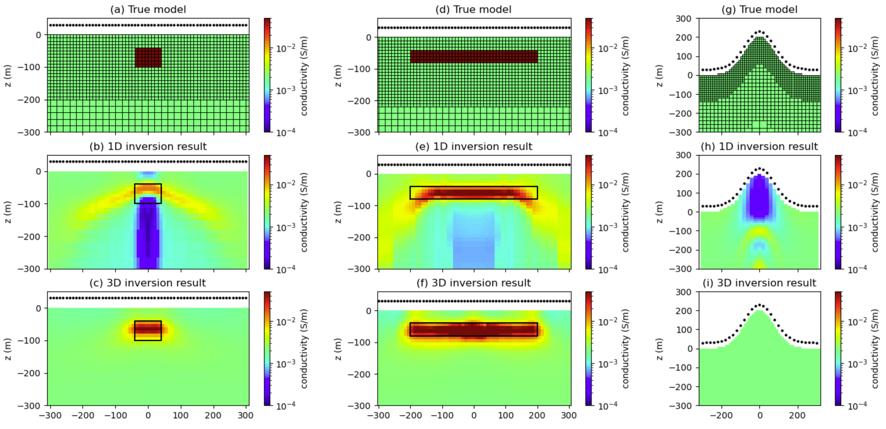{width="5.833333333333333in"
height="2.8325590551181103in"}

**Figure 1.** Examples of where 1D inversions can break down. The top
row shows the true models of (a) a compact conductor, (b) a flat-lying
conductor, (c) a topographic feature with uniform, homogeneous
conductivity. An Octree mesh that is refined near the surface is used
for all simulations. The black dots indicate the sounding locations used
in the inversions. A step-off waveform is used and 20 time channels from
$2 \times 10^{- 2}$ms to 2ms are used for the respective 1D and 3D
inversions (second and third row, respectively).

This paper illustrates the value of incorporating 3D forward simulation
into the interpretation workflow. We use the UBC-GIF TD OcTree tiled
code (Haber, and Schwarzbach. 2014), as well as the 1D and 3D SimPEG
time-domain codes in our analysis (Kang et al. 2018; Heagy et al. 2017).
By simulating the responses of inversion-derived models in 3D, one can
quickly assess the internal consistency of results and identify
problematic artifacts. Through two examples, a dipping conductor and a
porphyry-style deposit, we demonstrate how models that appear plausible
in 1D fail under 3D scrutiny. This approach enables iterative hypothesis
testing, helps guide targeted 3D inversion, and ultimately improves the
reliability of geophysical interpretations.

# Example 1: dipping target

The first example we consider is of the dipping target shown in Figure
[2](#fig:dipping-target). The target has a conductivity of 0.05 S/m (20
$\Omega$m) and is embedded in a 0.002 S/m (500 $\Omega$m) half-space.
The target has a dip of $45^{\circ}$ and extends from $y = - 400$ m to
$y = 400\ $m. We simulate a single line of data with a 10 m loop source
at a height of 30 m above the surface. The along-line spacing is 20 m,
and the line extends from $x = - 300\ $m to $300$ m. We use a step-off
waveform and measure the vertical component of $db/dt$ at 20 time
channels from $2 \times 10^{- 2}\ $ms to 2 ms. The 1D inversions are
each independent, and no lateral or spatial constraints are included.
For the 3D inversion, we use a large $\ \alpha_{y}\ $value to recover a
structure that is approximately 2D (very smooth in the *y*-direction,
which is oriented into the page). The 1D and 3D recovered models are
shown in Figure [2](#fig:dipping-target)b and 2c, respectively.

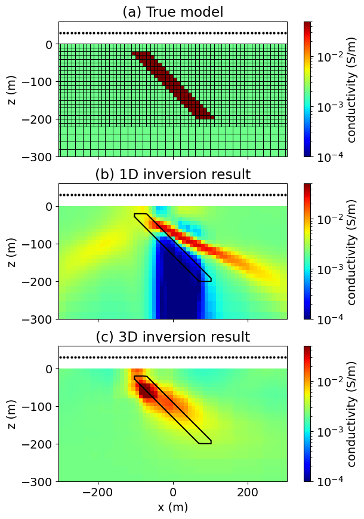{width="3.5in" height="4.986065179352581in"}

**Figure 2.** Inversion of AEM data collected over a target with a dip
of 45 degrees. (a) True model. Black dots indicate sounding locations.
(b) Model obtained through 1D inversion of data. (c) Model obtained
through 3D inversion.

The 1D inversion recovers a dipping target, but the recovered dip
($\sim 30^{\circ}$) is shallower than the true dip ($\sim 45^{\circ}$),
and the recovered target extends further in the down-dip direction,
extending out to nearly *x* = 200 m, whereas the true target only
extends to *x* = 100 m. There are other notable inversion artifacts,
including the strong resistor beneath the target, as well as a fainter
conductive artifact that extends from the top of the target to *x* =
-200m. The 3D inversion recovers the correct dip and location of the
target, although not its full extent at depth, as we lose resolution
with depth as the currents diffuse downwards and outwards.

In Figure [3](#fig:dipping-target-data-fits), we show the data fits for
every 4th time channel. The top row (Figure
[3](#fig:dipping-target-data-fits)) shows the "observed" data from the
true model (black) and the predicted data obtained by performing 1D
simulations of the 1D recovered models (blue lines). Each sounding fits
the observed data well. Next, we perform a 3D simulation of the 1D
recovered model. To obtain a model on the 3D mesh, we interpolate the
log-conductivity values obtained from the 1D inversion onto the 3D mesh,
assuming that the model does not change in the *y*-direction. We then
run a 3D forward simulation and obtain the results shown in Figure
[3](#fig:dipping-target-data-fits)b (red lines). These results are
noticeably different and have a much poorer fit, where we see the
anomaly. To better illustrate the differences between the simulation
results, we show a single time channel comparison of all of the results
in Figure [4](#fig:dipping-target-fits-comparison)a, as well as a single
sounding at *x* = 0 m in Figure
[4](#fig:dipping-target-fits-comparison)b. Although the 1D inversions do
a good job fitting the data, when we simulate the full 3D structure, it
simply does not agree with the observed data. The 3D inversion (Figure
3c, green lines), however, fits the data well and has a reasonable
recovery of the target, because it fully simulates the 3D physics.

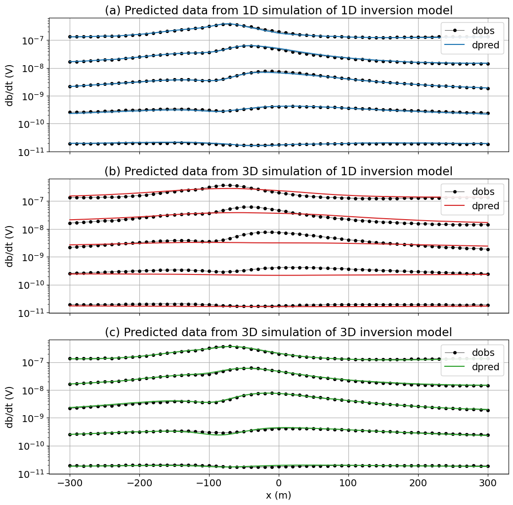{width="5.833333333333333in"
height="5.749036526684164in"}

**Figure 3.** Plots of the observed and predicted data for every 4th
time-channel. (a) 1D simulations performed over the 1D inversion result.
(b) 3D simulation performed over the 1D inversion result. (c) 3D
simulation performed over the 3D inversion result.

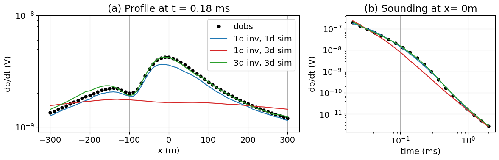{width="5.833333333333333in"
height="1.873406605424322in"}

**Figure 4.** Predicted and observed data for: (a) a profile at t=0.18
ms, and (b) a single sounding at x=0 m.

To illustrate how the 1D assumption breaks down, it can be insightful to
look at the EM fields through time. Figure
[5](#fig:dipping-target-fields-center) shows the current density (left)
and *db/dt* field (right) through time for the sounding located at *x* =
0 m. At early times, we see strong current density values near the updip
portion of the target. The 1D inversion needs to explain the resulting
*db/dt* measurements, so it brings the conductive layer shallower. The
currents reach the edges of the target in the mid-to-late times, which
cannot be accounted for in a 1D inversion that assumes the layer extends
laterally to infinity. The inversion tries to explain the data by
introducing a strong resistor underneath the conductive target. For an
offset source, such as at *x* = 100 m, we can again gain insights into
the artifacts produced by the 1D inversion by looking at the fields
shown in Figure [6](#fig:dipping-target-fields-offset). Although the
source is not over the target, it is still close enough to couple with
it and induce currents. As a result, this sounding produces a *db/dt*
response that can be measured and needs to be explained by the recovered
model at that location.

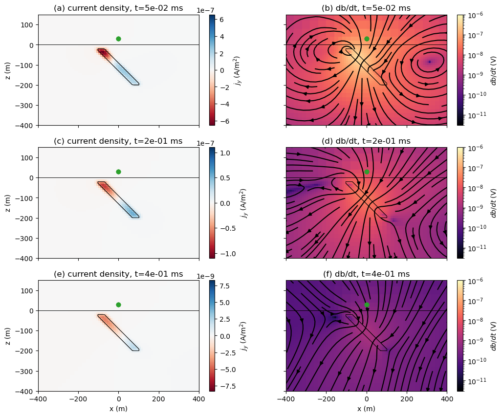{width="5.833333333333333in"
height="4.845017497812774in"}

**Figure 5.** Plots of the current density (left) and db/dt (right)
fields at three different times for a source at x=0 m, z = 30 m (green
dot).

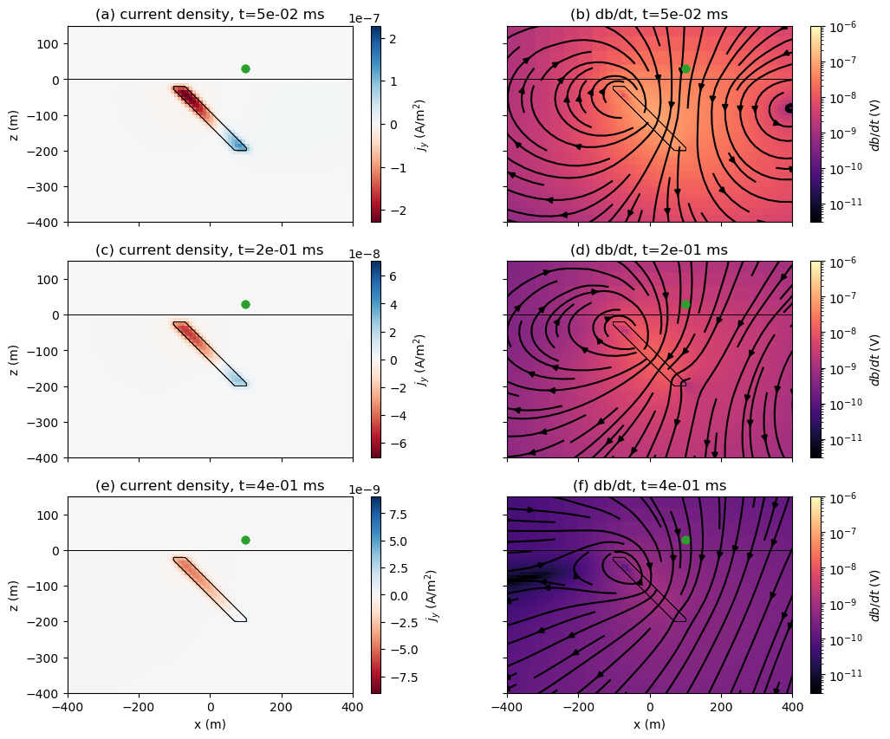{width="5.833333333333333in"
height="4.845017497812774in"}

**Figure 6.** Plots of the current density (left) and db/dt (right)
fields at three different times for a source at x=100m.

# Example 2: Synthetic inspired by Mt. Milligan deposit

Mt. Milligan is an alkalic porphyry Cu-Au deposit located approximately
155 km northwest of Prince George in British Columbia, Canada. It lies
within the Early Mesozoic Quesnel Terrane, where many similar porphyry
deposits have been discovered (DeLong et al., 1990; Oldenburg et al.,
1997). In 2007, a VTEM survey was flown over the deposit as a part of
the Geoscience BC QUEST project. Yang and Oldenburg, (2012) inverted
these data in 3D to produce a model that agreed well with the known
geologic information from drilling. They also developed a synthetic
example to illustrate the pitfalls of 1D inversion for this geologic
model. Here, we revisit the synthetic model first presented in Yang and
Oldenburg (2012).

The model is shown in Figure [7](#fig:mt-mill)a as a cross-section, and
Figure [7](#fig:mt-mill)b shows a depth slice. We use mesh cells that
are 50 m x 50 m x 25 m. The overburden is 50m thick and has a
resistivity of 10 $\Omega$m (0.01 S/m). The background is
500$\ \Omega$m. The deposit consists of two regions. The inner portion
is a resistive (1000 $\Omega$m) stock that hosts the mineralization.
Surrounding the resistive stock is an altered region that is more
conductive (20 $\Omega$m). We simulate a higher-density survey than Yang
and Oldenburg (2012), and use a line spacing of 100 m. Along each line,
we use soundings that are 50 m apart for the inversions.

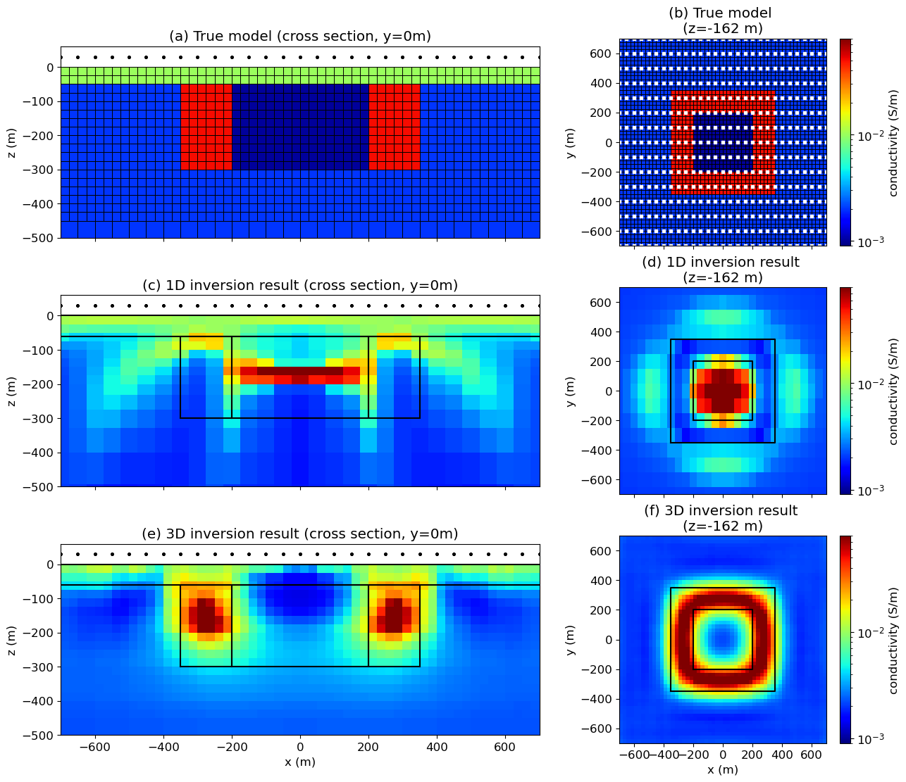{width="5.833333333333333in"
height="5.039527559055118in"}

**Figure 7.** Synthetic model inspired by the Mt. Milligan deposit
(after Yang and Oldenburg, 2012). (a) Cross-section through the true
model. (b) Depth slice of the true model at z = 162 m. White dots
indicate sounding locations. (c, d) Cross-section and depth slice
through the model recovered using 1D inversion. (e, f). Cross-section
and depth slice through the model recovered using 3D inversion.

The models obtained by inverting the data in 1D and in 3D are shown in
Figure [7](#fig:mt-mill)c-f. These models tell two very different
geologic stories. The 1D inversion recovers a conductor where the
resistive core should be, whereas the 3D inversion does a good job of
recovering the resistive core and conductive altered halo that hosts the
mineralization.

In Figure [8](#fig:mt-mill-data-fits), we show a comparison of the
"observed" data from the 3D simulation along with the predicted data
from the inverted models. Figure [8](#fig:mt-mill-data-fits)a shows the
data predicted by 1D simulations of each sounding from the 1D inversion
model. The data are well-fit in the inversion. However, when we
interpolate this model onto a 3D OcTree mesh and perform a 3D
simulation, we see that the predicted data are a poor representation of
the observed data, particularly in the mid and late times over the
deposit, as shown in Figure [8](#fig:mt-mill-data-fits)b. The 3D
inversion result fits the observed at all time channels (Figure 8c).

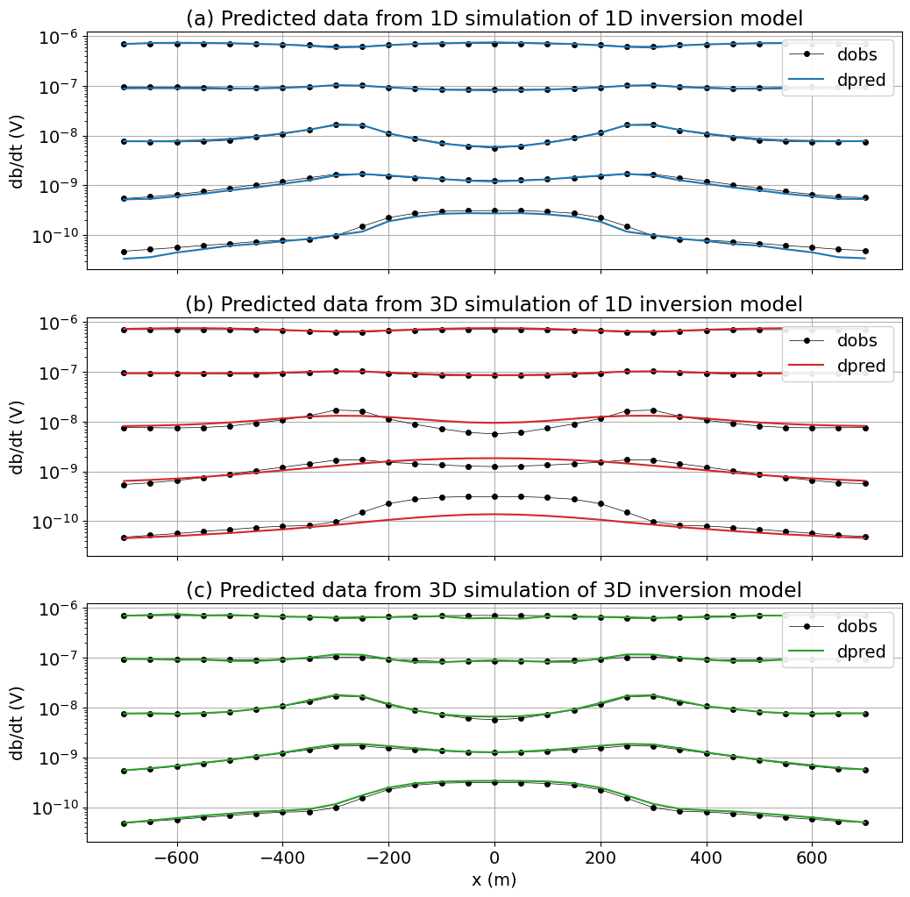{width="5.833333333333333in"
height="5.749036526684164in"}

**Figure 8.** Plots of the observed and predicted data for every 4th
time-channel along the y = 0 m line for the Mt. Milligan example. (a) 1D
simulations performed using the model from the 1D inversion. (b) 3D
simulation performed over the model obtained from 1D inversion. (c) 3D
simulation performed with the model obtained through 3D inversion.

In Figure [9](#fig:mt-mill-data-comparison), we plot a profile of a
single time channel (Figure 9a), and a single sounding at x = 0 m
(Figure 9b), with all results together to compare. While the 1D
inversion model appears to fit the data when simulated with a 1D
algorithm, when we simulate the 1D model with a 3D algorithm, we see
that the anomaly produced has a completely different character than the
observed data. It can also be insightful to look at misfit maps, which
we show for a single time channel in Figure
[10](#fig:mt-mill-data-maps). Again, we see that the character of the
anomaly produced by the 1D model is completely different from the
predicted data, and in the misfit plot in Figure
[10](#fig:mt-mill-data-maps)c, we coherent structure that is similar in
character to the true data in Figure [10](#fig:mt-mill-data-maps)a,
which should serve as a red-flag for interpreters.

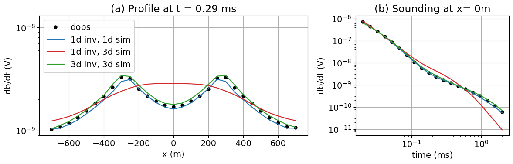{width="5.833333333333333in"
height="1.873406605424322in"}

**Figure 9.** Predicted and observed data for: (a) a profile at t = 0.29
ms, and (b) a single sounding at x= 0 m, y = 0 m. The source is at z =
30 m.

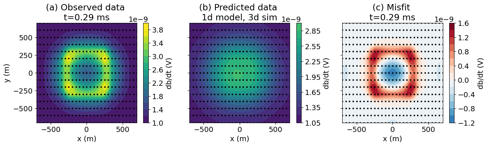{width="5.833333333333333in"
height="1.760249343832021in"}

**Figure 10.** Time-slice of data: (a) observed data from the true
model, (b) data computed by a 3D simulation of the model obtained
through 1D inversion, (c) misfit (observed - predicted).

To help understand how the 1D assumption breaks down for this example,
we show the currents and db/dt field for a sounding over the center of
the deposit in Figure [11](#fig:mt-mill-fields-center). Currents
concentrate in the conductive altered zone, and the 1D inversion
explains the *db/dt* response by putting a conductor beneath the
sounding location. This happens for offset soundings as well. In Figure
[12](#fig:mt-mill-fields-offset) we simulate a sounding at the interface
between the resistive stock and the conductive alteration halo (*x* =
200 m, *y* = 0 m). At early times, the currents are concentrated in the
conductive altered zone closest to the transmitter. At later times, the
currents have diffused further and circulate through the whole altered
zone, similar to when the sounding was at the center of the deposit.
These effects are highly 3D, but the 1D inversion can fit the sounding
by again putting a conductive unit beneath the transmitter.

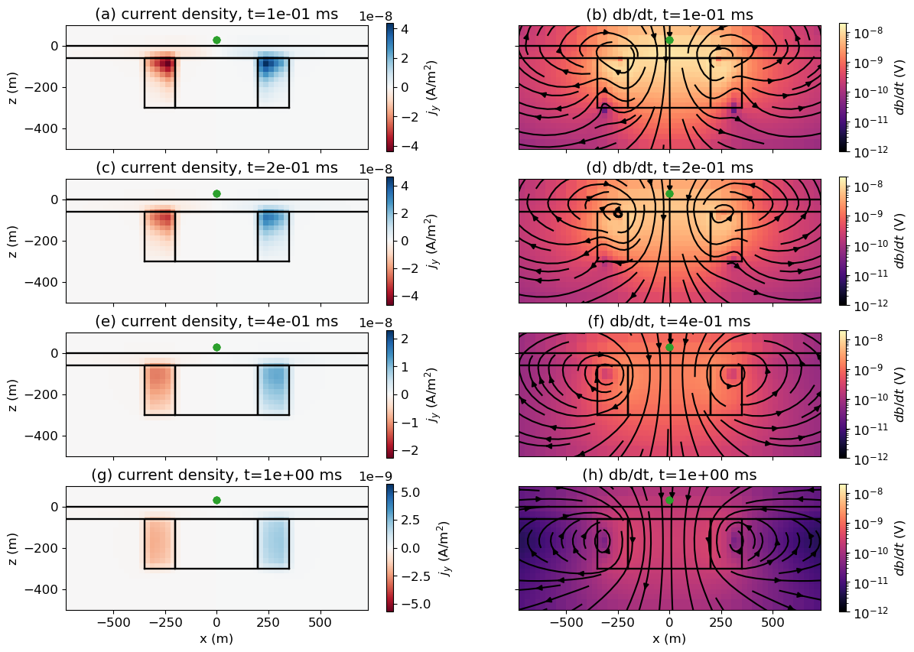{width="5.833333333333333in"
height="4.163876859142607in"}

**Figure 11.** Plots of the current density (left) and db/dt (right)
fields at three different times for a source at x=0m for the Mt.
Milligan example.

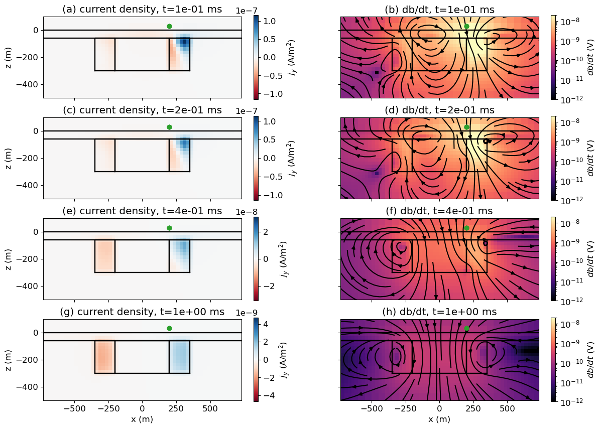{width="5.833333333333333in"
height="4.163876859142607in"}

**Figure 12.** Plots of the current density (left) and db/dt (right)
fields at three different times for a source at x=200m, y=0m for the Mt.
Milligan example.

# Discussion

The two examples presented, a dipping target and a deposit model
inspired by the Mt. Milligan Porphyry deposit, illustrate examples where
1D inversion produces misleading results that could lead to incorrect
interpretations. For the example of the dipping target, we showed that
the recovered dip of $\sim 30^{\circ}$ was much shallower than the true
dip of 45$^{\circ}$, and the target appears to extend further along the
profile than it does in reality. For the Mt. Milligan example, the 1D
inversion model leads to an entirely different interpretation, as
pointed out by Yang and Oldenburg (2012). It shows a conductive
structure where the resistive core is, and places a shallow conductor
where the altered halo that contains the mineralization should be. In
both examples, the 1D inversions can fit the data well when each
sounding is simulated in 1D. If this is the only metric used to assess
the quality of the result, there is a large risk of placing false
confidence in that model. This can lead to costly mistakes in drilling
or in choosing whether to further develop a property or to let it go.

By taking the model obtained through 1D inversion, interpolating it onto
a 3D mesh and performing a 3D forward simulation, we can test whether
that model produces data that are similar to the observed data or not.
The data fit can be quantified by a single number, the data misfit, but
it is important to look at profiles and maps. By looking at profiles and
maps of individual time channels and their misfits, we can identify
problematic regions and areas with coherent signals that is are not
being fit. This should prompt questions and further analysis for
features of interest. Hypothesis testing can be performed by simplifying
the model and running forward simulations, for example, testing if a
compact conductor at the center of the Mt. Milligan survey area, in
fact, fits the data. This can be followed up with 3D inversions on
subsets of the data. Forward simulations in 3D can be even more
important when 3D survey geometries are employed and the data are less
intuitive to interpret (Cheng et al., 2023).

# Conclusions

Modern electromagnetic surveys routinely deliver high-quality datasets
with dense spatial coverage, enabling detailed imaging of the
subsurface. Yet despite this extensive data, interpretation is often
carried out by invoking simplifying assumptions, such as treating the
subsurface as a 1D layered earth or approximating targets as conductive
plates. While these assumptions reduce computational cost and are often
sufficient in layered settings, they can introduce significant artifacts
when applied to complex geology. Critically, the apparent success of
these inversions in fitting the data does not guarantee that the
resulting model is physically plausible in 3D.

This is where 3D forward simulation becomes indispensable. By applying
full 3D physics to models derived from simpler assumptions,
practitioners can test whether those models genuinely reproduce the
observed data. When discrepancies arise, they can reveal where further
refinement, hypothesis testing, or targeted 3D inversion is warranted.
With a growing ecosystem of open-source and proprietary simulation
tools, along with improving tutorials and community support, 3D forward
simulation is increasingly accessible. It should be embraced as a
routine step in EM interpretation workflows, not just for advanced
users, but for anyone aiming to produce reliable, decision-ready
subsurface models.

# Acknowledgment

The authors are grateful to the two anonymous referees who took the time
to help improve the quality of this manuscript.

# References

Börner, R. U., O. G. Ernst, and K. Spitzer. 2008. Fast 3-D Simulation of
Transient Electromagnetic Fields by Model Reduction in the Frequency
Domain Using Krylov Subspace Projection. *Geophysical Journal
International,* 173, 3, 766--80.
<https://doi.org/10.1111/j.1365-246X.2008.03750.x>.

Brodie, R. C., and M. Richardson. 2015. Open Source Software for 1D
Airborne Electromagnetic Inversion. *ASEG Extended Abstracts,* 2015, 1,
1--3. <https://doi.org/10.1071/ASEG2015ab197>.

Cheng, M., Yang, D., Luo, Q., 2023. Interpreting Surface Large-Loop
Time-Domain Electromagnetic Data for Deep Mineral Exploration Using 3D
Forward Modeling and Inversion. *Minerals* 13, 34.
https://doi.org/10.3390/min13010034

Cockett, R., S. Kang, L. J. Heagy, A. Pidlisecky, and D. W. Oldenburg.
2015. SimPEG: An Open Source Framework for Simulation and Gradient Based
Parameter Estimation in Geophysical Applications. *Computers &
Geosciences,* 85,142--54. <https://doi.org/10.1016/j.cageo.2015.09.015>.

Cox, L. H., G. A. Wilson, and M. S. Zhdanov. 2010. 3D Inversion of
Airborne Electromagnetic Data Using a Moving Footprint. *Exploration
Geophysics,* 41, 4, 250--59. <https://doi.org/10.1071/EG10003>.

DeLong, R. C., C. I. Godwin, M. W. Harris, N. M. Caira, and C. M.
Rebagliati, 1990. Geology and alteration at the Mount Milligan
Gold-Copper Porphyry Deposit. Central British Columbia (93N71E).
*Geological Fieldwork*.
https://propertyfile.gov.bc.ca/reports/PF885720.pdf

Farquharson, C. G., and D. W. Oldenburg. 1993. Inversion of Time-Domain
Electromagnetic Data for a Horizontally Layered Earth. *Geophysical
Journal International* 114, 3, 433--42.
<https://doi.org/10.1111/j.1365-246X.1993.tb06977.x>.

Fiandaca, G., E. Auken, A. V. Christiansen, and A. Gazoty. 2012.
Time-Domain-Induced Polarization: Full-decay Forward Modeling and 1D
Laterally Constrained Inversion of Cole-Cole Parameters. *Geophysics,*
77, 3, 213--25. <https://doi.org/10.1190/geo2011-0217.1>.

Haber, E., and S. Heldmann. 2007. An Octree Multigrid Method for
Quasi-Static Maxwell's Equations with Highly Discontinuous Coefficients.
*Journal of Computational Physics,* 223, 2, 783--96.
<https://doi.org/10.1016/j.jcp.2006.10.012>.

Haber, E., and C. Schwarzbach. 2014. Parallel Inversion of Large-Scale
Airborne Time-Domain Electromagnetic Data with Multiple OcTree Meshes.
*Inverse Problems,* 30, 5, 055011.
<https://doi.org/10.1088/0266-5611/30/5/055011>.

Heagy, L. J., R. Cockett, S. Kang, G. K. Rosenkjaer, and D. W.
Oldenburg. 2017. A Framework for Simulation and Inversion in
Electromagnetics. *Computers and Geosciences*, 107, 1--19.
<https://doi.org/10.1016/j.cageo.2017.06.018>.

Kang, S., and D. W. Oldenburg. 2016. On Recovering Distributed IP
Information from Inductive Source Time Domain Electromagnetic Data.
*Geophysical Journal International,* 207, 1, 174--96.
<https://doi.org/10.1093/gji/ggw256>.

Kang, S., D. Fournier, D. Werthmuller, L. J. Heagy, and D. W. Oldenburg.
2018. SimPEG-EM1D: Gradient-Based 1D Inversion Software for Large-Scale
Airborne Electromagnetic Data. In *AGU Fall Meeting Abstracts*,
2018:NS53A--0557.

Lu, X., and C. G. Farquharson. 2020. 3D Finite-Volume Time-Domain
Modeling of Geophysical Electromagnetic Data on Unstructured Grids Using
Potentials. *Geophysics*, 85, 6, 221--40.
<https://doi.org/10.1190/geo2020-0088.1>.

Macnae, J., K. Witherly, and T. Munday. 2012. 3D EM Inversion: An Update
on Capabilities and Outcomes. *Preview*, 2012, 159, 24--27.
<https://doi.org/10.1071/PVv2012n159p24>.

Oldenburg, D.W., Y. Li, R.G. Ellis, 1997. Inversion of geophysical data
over a copper gold porphyry deposit; a case history for Mt. Milligan.
*Geophysics* 62, 1419--1431. https://doi.org/10.1190/1.1444246

Rochlitz, R., N. Skibbe, and T. Günther. 2019. custEM: Customizable
Finite-Element Simulation of Complex Controlled-Source Electromagnetic
Data. *Geophysics,* 84 (2): F17--33.
<https://doi.org/10.1190/geo2018-0208.1>.

Smith, R.. 2014. Electromagnetic Induction Methods in Mining Geophysics
from 2008 to 2012. *Surveys in Geophysics,* 35, 1, 123--56.
<https://doi.org/10.1007/s10712-013-9227-1>.

Viezzoli, A., A. V. Christiansen, E. Auken, and K. Sørensen. 2008.
Quasi-3D Modeling of Airborne TEM Data by Spatially Constrained
Inversion. *Geophysics,* 73, 3, F105--13.
<https://doi.org/10.1190/1.2895521>.

Yang, D., and D. W. Oldenburg. 2016. Survey Decomposition : A Scalable
Framework for 3D Controlled-Source Electromagnetic Inversion.
*Geophysics*, 81, 2, E69--87. <https://doi.org/10.1190/GEO2015-0217.1>.

Yang, D., and D. W. Oldenburg. 2012. "Three-Dimensional Inversion of
Airborne Time-Domain Electromagnetic Data with Applications to a
Porphyry Deposit." *Geophysics,* 77, 2, B23--34.
<https://doi.org/10.1190/geo2011-0194.1>.

[^1]: https://www.earthscope.org/

[^2]: https://www.ga.gov.au/about/projects/resources/auslamp
